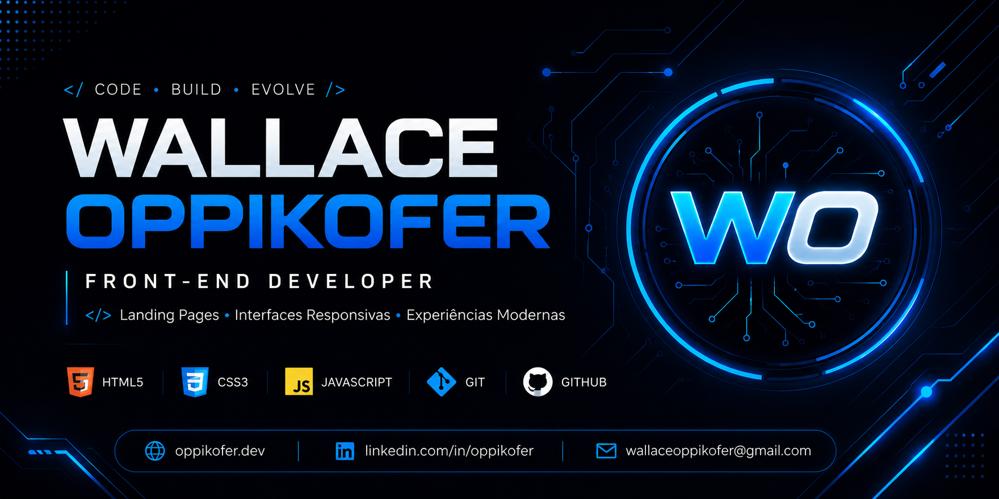

Olá, eu sou Wallace 👋

💻 Desenvolvedor Front-End focado em HTML, CSS e JavaScript
🚀 Criando landing pages modernas, responsivas e interfaces web funcionais
🎯 Interessado em desenvolvimento web, experiência do usuário e projetos práticos
📚 Evoluindo constantemente através da construção de aplicações e novos desafios

🚀 Tecnologias
HTML5 
CSS3 
JavaScript 
Git & GitHub 
📌 Projetos

Aqui você encontrará projetos voltados para desenvolvimento Front-End, landing pages, interfaces responsivas e aplicações criadas para prática e evolução técnica.
